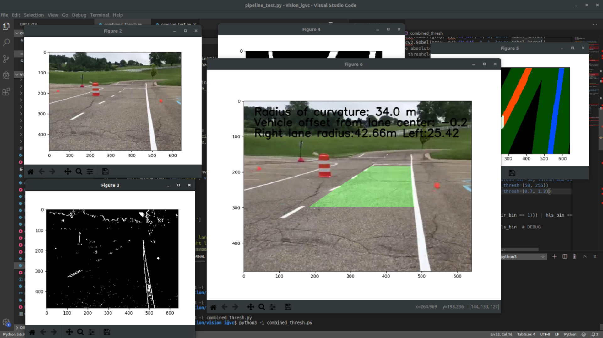

# Overview
IGVC 2020 - Wayne State  
ROS workspace for the Auto-Nav challenge. Completed lane detection pipeline with lanes converted to laser scans and merged with LIDAR.

### Converting lanes to laser scan

[lane_laser_scan](src/lane_laser_scan/Scripts/lane_laser_scan.py) converts the image matrix to a (distance, angle) array and publishes the sensor_msgs/LaserScan Message.

Change the index of the usb camera in lane_laser_scan.py.  
`ls -l /dev |grep ttyUSB` for rplidar or `ls -l /dev |grep ttyACM` for Hokuyo lidar to get the name of the LiDAR.  
`sudo chmod 666 /dev/ttyACM0` to change permission.  
`roslaunch lane_laser_scan lane_hokuyo` will launch the lane detection pipeline and convert image frames to laser scans and merge with the LiDAR's laser scans.  

### Lane Detection Pipeline
/lane_laser_scan/pipeline_test.py serves as the integration test for all the operations. Change the source file image and perspective transform matrix.
#### Outline
Forked from [George Sung](https://github.com/georgesung/advanced_lane_detection) 
Get distortion matrix > Correct distortion > Binary Threshold > Perspective transform > Detect lane and curve fit > Draw area back on original raw image.

